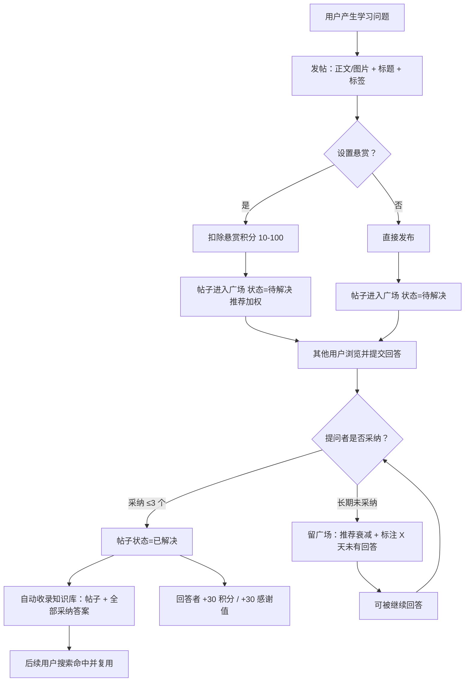
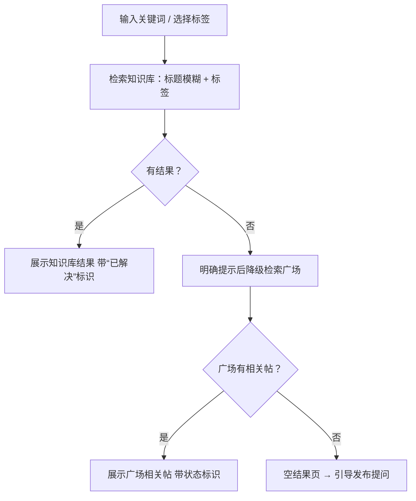
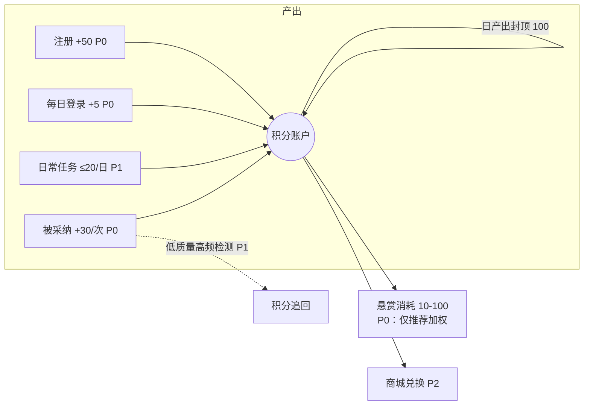
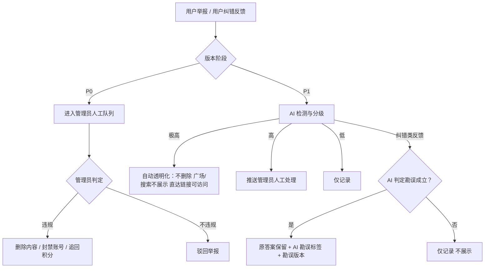
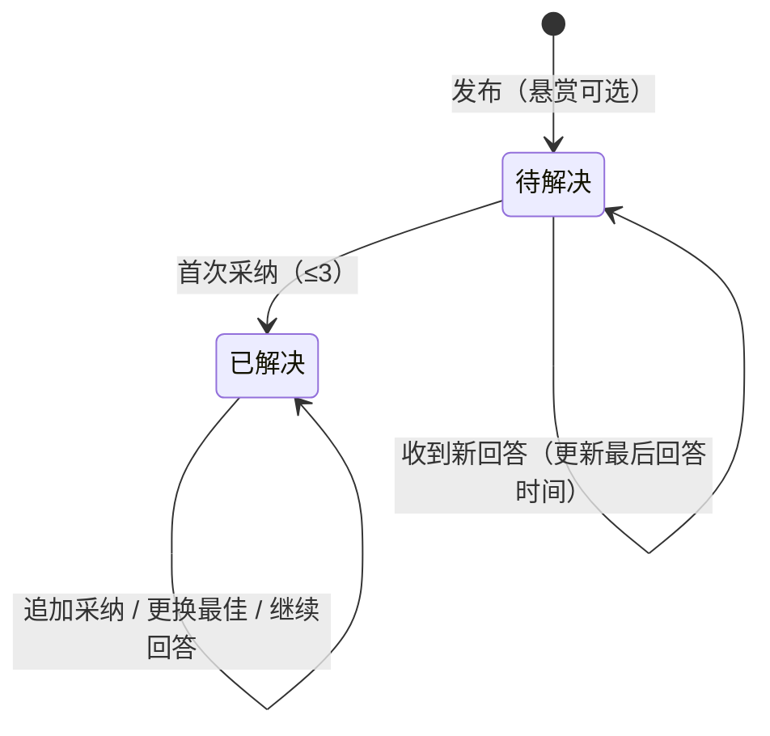

# 《"畅学"社区产品需求文档 (PRD) V1.0》

> 本文档为**总册**：覆盖产品全部功能模块（P0/P1/P2），作为后续所有版本迭代的唯一需求基准。配套文档：《功能需求详述》（附录）、《畅学社区 MVP 版本交付清单》。

***

## 1. 文档基础信息

| 项目   | 内容                             |
| ---- | ------------------------------ |
| 文档名称 | 《"畅学"社区产品需求文档 (PRD) V1.0》      |
| 创建日期 | 2026-09-01                     |
| 版本号  | V1.0                           |
| 文档状态 | 待评审                            |
| 文档性质 | 总册（覆盖 P0/P1/P2 全量功能，只增不减）      |
| 配套文档 | 《功能需求详述》（附录）、《畅学社区 MVP 版本交付清单》 |

### 1.1 文档修订记录

| 日期         | 版本     | 修改章节   | 修改人    |
| ---------- | ------ | ------ | ------ |
| 2026-09-01 | V1.0   | 全文创建   | \[待补充] |
| <br />     | <br /> | <br /> | <br /> |

> 修订规则：总册只增不减；仅当发现严重逻辑漏洞时允许修正既有条目，修正须在修订记录中注明章节与原因，并经评审确认。

***

## 2. 需求范围与边界

### 2.1 本期包含（In-Scope）

总册覆盖以下全部模块（逐功能优先级标注见第 5 章）：

1. **M1 账号与个人中心**：注册/登录、个人资料、个人主页、本校/本专业过滤（P1）、个性化装饰（P2）
2. **M2 问答核心**：发帖提问（含悬赏）、回答、采纳（多采纳/最佳答案/更换）、双层评论、点赞收藏、帖子状态机
3. **M3 广场与内容分发**：帖子广场（推荐/最新/待解决 Tab）、悬赏推荐加权、本校/本专业 Tab（P1）
4. **M4 搜索与知识库**：搜索（标签筛选+标题模糊，知识库优先、降级广场）、知识库自动收录、AI 相似问答匹配（P1）
5. **M5 激励体系**：积分账户与流水、感谢值、助人榜（周/月）、日常任务体系（P1）、积分商城（P1 接口 / P2 交易闭环）
6. **M6 通知中心**：站内通知（P0 最简版）
7. **M7 治理与合规**：举报入口、管理员基础处置（P0）、AI 违规检测与分级处置（P1）、纠错反馈与 AI 勘误（P1）、管理员完整后台（P1）、管理员晋升通道（P2）
8. **M8 AI 能力矩阵**：LLM 统一网关（P0 仅接口契约，P1 实现）、AI 摘要生成、AI 参考回答、回答可靠性检测、回答质量检测与积分追回（均 P1；P0 仅保留接口与页面占位）
9. **M9 社交与个性化**：私聊（P2）、100 人内群聊（P2）、个性化装饰（P2）

### 2.2 本期不包含（Out-of-Scope）

**产品层面明确不做（任何版本均不包含）：**

1. 不做全文检索/语义搜索引擎（检索能力仅限标签筛选 + 标题模糊匹配）
2. 不做用户学校认证与实名认证（学校/专业由用户自填）
3. 不做多语言支持（仅中文）
4. 不做提问者/回答者角色权限分裂（单一用户类型，人人可问可答）
5. AI 生成内容不可被采纳、不可进入助人榜与回答排序
6. 不做超过 100 人的群聊
7. 不做直播、视频课程等课程类内容形态
8. AI 不作为内容删除与封号的决策主体（AI 仅可执行"透明化"这一非删除类处置，删除/封号必须由人工执行）
9. 不做第三方登录与社交分享（首版排除，是否永久排除\[待补充]）

**MVP（P0）阶段不包含、后续版本补充：**

- AI 全部功能（P0 仅交付接口契约与页面占位，不接入模型调用）

- 私聊、群聊、个性化装饰、积分商城交易闭环

- 日常任务体系、AI 分级治理、纠错反馈链路

- 密码找回（随 P1 账号体系完善补充）

### 2.3 前置决策项（阻塞开发，须在评审前确认）

| 决策项                         | 当前状态                                    | 影响范围          |
| --------------------------- | --------------------------------------- | ------------- |
| 注册/登录方式（账号密码 / 手机验证码 / 第三方） | \[待补充]                                  | 账号模块、MVP 全流程  |
| 产品平台形态（Web / 小程序 / App）     | \[待补充]                                  | 全局技术方案与 UI 适配 |
| 初始领域标签集清单                   | \[待补充]（建议按学科大类：高等数学、大学英语、程序设计、考研等，评审确定） | 发帖、搜索、知识库分类   |
| 推荐衰减阈值天数                    | 建议默认 14 天（后台可配参数），待评审确认                 | 广场推荐逻辑        |

***

## 3. 产品概述

### 3.1 背景与痛点

大学生的学习求助分散于 QQ 群、群聊、知乎、公众号等载体，存在以下结构性问题：

| 痛点    | 现状描述                         |
| ----- | ---------------------------- |
| 解答即焚  | 优质解答只存在于聊天记录中，随对话沉没，无法统一收录复用 |
| 资料分散  | 学习资料与问答散落在多个群、多个平台，检索成本高     |
| 重复提问  | 相同问题在不同群被反复提出，回答者重复劳动        |
| 助人无回报 | 回答者只有即时成就感，无持续的荣誉与激励反馈       |

### 3.2 产品定位与价值主张

**一句话定位**：面向全国大学生的学习问答社区——提问被结构化沉淀，解答被采纳入库成为可检索的知识库，以积分（货币）+感谢值（荣誉）双轨激励维持解答供给。

**差异位**：

| 对比对象    | 畅学的差异                           |
| ------- | ------------------------------- |
| 知乎      | 聚焦大学生学习场景，轻提问（支持图片）、强激励（助人榜+积分） |
| QQ 群/群聊 | 解答持久沉淀、结构化检索，不随对话消失             |
| 公众号     | 双向互动、人人可答，而非单向推送                |

### 3.3 产品目标与成功标准

**北极星指标：周采纳数**（直接度量"解决了多少问题"，是供给、质量、需求三端健康的交点）

| 时间      | 目标                                                  |
| ------- | --------------------------------------------------- |
| 上线 3 个月 | 种子高校 3-5 所，DAU ≥ 500，24h 内有回答率 ≥ 60%                |
| 上线 6 个月 | DAU/MAU 粘性比 ≥ 25%，搜索解决率 ≥ 40%，回答者 7 日留存 > 提问者 7 日留存 |

***

## 4. 用户与使用场景

### 4.1 用户角色

| 角色       | 定义                      | 权限要点                             |
| -------- | ----------------------- | -------------------------------- |
| 普通用户     | 全国大学生，单一用户类型（人人可问可答）    | 发帖、回答、评论、点赞收藏、搜索、悬赏、举报           |
| 管理员      | 独立运营角色（P2 预留高感谢值用户晋升接口） | 举报处理、违规处置（删/封/追分/透明化）、内容巡检       |
| 官方 AI 账号 | 系统账号（P1 上线）             | 全帖挂载 AI 参考回答；固定标识、不可被采纳、不参与榜单与排序 |

### 4.2 用户画像

| 画像  | 描述                      | 核心诉求                             |
| --- | ----------------------- | -------------------------------- |
| 提问者 | 遇到课程/作业/考研问题，群里问不到答案的学生 | 极低成本提问（可拍照），快速获得认真解答，答案可被后来人复用   |
| 回答者 | 有分享欲与成就感的学霸             | 被采纳的成就感（感谢值+助人榜），积分回报（悬赏曝光、商城兑换） |
| 管理员 | 平台运营人员                  | 高效处置违规，人工兜底 AI 判定                |

### 4.3 核心使用场景

| #  | 场景          | 路径                                            |
| -- | ----------- | --------------------------------------------- |
| S1 | 学生遇到一道不会的题  | 拍照发帖（设标题+标签）→ 悬赏增加曝光 → 收到回答 → 采纳 → 帖子标"已解决"入库 |
| S2 | 学生发问前先搜     | 输入关键词 → 命中知识库已解决帖 → 直接获得答案，不再发帖               |
| S3 | 学霸日常助人      | 浏览"待解决"Tab → 回答 → 被采纳 → 感谢值上升进入周榜 → 获得积分      |
| S4 | 用户发现违规内容    | 点击举报 → 管理员处理 /（P1）AI 分级自动透明化                  |
| S5 | 用户发现知识库答案有误 | 提交纠错反馈 →（P1）AI 判定 → 原答案保留 + "AI 勘误"标签 + 勘误版本  |

***

## 5. 功能列表与优先级（概览）

> 优先级采用 MoSCoW 法则，与版本映射为：**P0 = Must have**（MVP 必须交付）、**P1 = Should have**（V1.x 交付）、**P2 = Could have**（V2.0 及以后）、Won't have = 第 2.2 节 Out-of-Scope。
> 本表仅作功能概览，每条功能的操作流程、交互规则、异常场景与验收标准**详见配套文档《功能需求详述》**，两者不重复。

### M1 账号与个人中心

| 编号    | 功能       | 优先级 | 功能概要                     | 依赖     |
| ----- | -------- | --- | ------------------------ | ------ |
| M1-F1 | 注册/登录    | P0  | 创建账号并登录，注册赠送 50 积分       | 无（基石）  |
| M1-F2 | 个人资料     | P0  | 编辑昵称、头像、学校、专业（自填，无认证）    | M1-F1  |
| M1-F3 | 个人主页     | P0  | 展示资料、感谢值、积分、我的帖/回答/收藏    | M1-F2  |
| M1-F4 | 本校/本专业过滤 | P1  | 广场 Tab 按学校/专业过滤帖子        | M1-F2  |
| M1-F5 | 个性化装饰    | P2  | 主页/背景/气泡/特效（参考 QQ 个性化体系） | M5-F21 |

### M2 问答核心

| 编号     | 功能        | 优先级 | 功能概要                             | 依赖           |
| ------ | --------- | --- | -------------------------------- | ------------ |
| M2-F6  | 发帖提问（含悬赏） | P0  | 文字+图片提问，标题+标签必填，可选悬赏（10-100 积分档） | M1-F1、M5-F17 |
| M2-F7  | 回答        | P0  | 对帖子提交正式回答；已解决帖可持续回答              | M2-F6        |
| M2-F8  | 采纳        | P0  | 提问者可采纳 ≤3 个回答，指定/更换"最佳答案"        | M2-F7        |
| M2-F9  | 双层评论      | P0  | 帖子/回答的评论，评论可被回复+点赞（二层封顶）         | M2-F6        |
| M2-F10 | 点赞收藏      | P0  | 帖子/回答可点赞+收藏，评论仅点赞                | M2-F6        |
| M2-F11 | 帖子状态机     | P0  | 待解决/已解决、时间标注、长期无采纳推荐衰减           | M2-F8        |

### M3 广场与内容分发

| 编号     | 功能     | 优先级 | 功能概要                | 依赖           |
| ------ | ------ | --- | ------------------- | ------------ |
| M3-F12 | 帖子广场   | P0  | 首页帖子流，Tab：推荐/最新/待解决 | M2-F6        |
| M3-F13 | 悬赏推荐加权 | P0  | 悬赏帖在推荐 Tab 获得排序加权   | M2-F6、M5-F17 |

### M4 搜索与知识库

| 编号     | 功能        | 优先级 | 功能概要                   | 依赖     |
| ------ | --------- | --- | ---------------------- | ------ |
| M4-F14 | 搜索        | P0  | 标签筛选+标题模糊；知识库优先，无果降级广场 | M4-F15 |
| M4-F15 | 知识库收录     | P0  | 帖子首次被采纳自动入库（帖+全部采纳答案）  | M2-F8  |
| M4-F16 | AI 相似问答匹配 | P1  | 搜索侧 AI 提升问答匹配相关性       | M8-F31 |

### M5 激励体系

| 编号     | 功能       | 优先级      | 功能概要                 | 依赖     |
| ------ | -------- | -------- | -------------------- | ------ |
| M5-F17 | 积分账户与流水  | P0       | 积分产出/消耗/封顶/追回，全量流水记录 | M1-F1  |
| M5-F18 | 感谢值      | P0       | 被采纳 +30/次，按周/月统计     | M2-F8  |
| M5-F19 | 助人榜（周/月） | P0       | 感谢值 Top 榜单，主页与榜单页展示  | M5-F18 |
| M5-F20 | 日常任务体系   | P1       | 每日任务（首帖/首答/浏览）得积分    | M5-F17 |
| M5-F21 | 积分商城接口   | P1       | 商品模型与兑换接口预留，无交易闭环    | M5-F17 |
| M5-F22 | 商城虚拟商品   | P2       | 平台装饰、气泡、点赞特效兑换       | M5-F21 |
| M5-F23 | 商城实物兑换   | P2（最后版本） | 文创实物兑换               | M5-F21 |

### M6 通知中心

| 编号     | 功能   | 优先级 | 功能概要                       | 依赖    |
| ------ | ---- | --- | -------------------------- | ----- |
| M6-F24 | 站内通知 | P0  | 被回答/被评论/被回复/被采纳/被点赞的聚合通知列表 | 各互动功能 |

### M7 治理与合规

| 编号     | 功能          | 优先级 | 功能概要                     | 依赖         |
| ------ | ----------- | --- | ------------------------ | ---------- |
| M7-F25 | 举报入口        | P0  | 帖子/回答/评论均可举报，进入人工队列      | 各内容功能      |
| M7-F26 | 管理员基础处置     | P0  | 查看举报队列；删除/封号/追回积分，操作留痕   | M7-F25     |
| M7-F27 | AI 违规检测与分级  | P1  | 极高→自动透明化；高→人工队列；低→仅记录    | M8-F31     |
| M7-F28 | 纠错反馈与 AI 勘误 | P1  | 用户纠错→AI 判定→原答案保留+AI 勘误标签 | M8-F31     |
| M7-F29 | 管理员完整后台     | P1  | 举报队列（带 AI 分级）、处置面板、数据看板  | M7-F26/F27 |
| M7-F30 | 管理员晋升通道     | P2  | 长期高感谢值用户授权管理员账号接口        | M5-F18     |

### M8 AI 能力矩阵（P0 仅接口契约与页面占位，P1 实现）

| 编号     | 功能        | 优先级           | 功能概要                             | 依赖       |
| ------ | --------- | ------------- | -------------------------------- | -------- |
| M8-F31 | LLM 统一网关  | P0 接口 / P1 实现 | 场景路由、提示词模板、失败降级、调用日志与成本统计，模型可热替换 | 无（AI 基石） |
| M8-F32 | AI 摘要生成   | P1            | 发帖时生成摘要供确认/修改，带 AI 标识（P0 页面占位）   | M8-F31   |
| M8-F33 | AI 参考回答   | P1            | 全帖挂载，官方 AI 账号，默认折叠+延迟展示          | M8-F31   |
| M8-F34 | 回答可靠性检测   | P1            | 采纳时对比检测回答质量与正确性                  | M8-F31   |
| M8-F35 | 回答质量检测与追回 | P1            | 先发后审；低质量高频追回采纳积分                 | M8-F31   |

### M9 社交与个性化

| 编号     | 功能 | 优先级 | 功能概要     | 依赖     |
| ------ | -- | --- | -------- | ------ |
| M9-F36 | 私聊 | P2  | 用户一对一私信  | M1-F1  |
| M9-F37 | 群聊 | P2  | 100 人内群聊 | M9-F36 |

### 关键依赖链（架构设计须按此预留扩展）

```
注册登录(M1-F1) → 发帖(M2-F6) → 回答(M2-F7) → 采纳(M2-F8) → 知识库(M4-F15) → 搜索(M4-F14)
                                    ↓
                    感谢值(M5-F18) → 助人榜(M5-F19)
                    积分(M5-F17) → 悬赏加权(M3-F13) / 商城(M5-F21)
LLM网关(M8-F31) → AI摘要/参考回答/检测/勘误/违规分级(M8-F32~35, M7-F27/F28)
```

***

## 6. 全局业务规则

> 本章为跨功能的业务规则，是《功能需求详述》的引用基准，两者不重复。

### 6.1 帖子状态机

| 规则   | 内容                                                               |
| ---- | ---------------------------------------------------------------- |
| 状态定义 | 无采纳 = **待解决**；≥1 个采纳 = **已解决**                                   |
| 时间展示 | 所有帖子显示发布时间；待解决帖若距最后一次回答超过阈值（建议默认 7 天，后台可配\[待评审]），额外强调"已 X 天未有回答" |
| 推荐衰减 | 无采纳且发布超过阈值（建议默认 14 天，后台可配\[待评审]）→ 推荐权重衰减                         |
| 持续开放 | 已解决帖可被继续回答与补充采纳；未采纳帖永不入知识库，留在广场                                  |

### 6.2 采纳规则

| 规则   | 内容                                                       |
| ---- | -------------------------------------------------------- |
| 采纳权限 | 仅提问者本人可采纳                                                |
| 数量上限 | 每帖最多采纳 3 个回答                                             |
| 标签展示 | 仅 1 个采纳时显示"采纳答案"；多个采纳时帖主指定 1 个"最佳答案"（置顶展示），其余显示"采纳答案"    |
| 更换最佳 | 可随时更换最佳答案，**不追回、不补发任何积分与感谢值**                            |
| 补充采纳 | 已解决帖可追加采纳（上限 3），新被采纳者正常获得积分与感谢值                          |
| 取消采纳 | \[待补充：是否允许取消单个采纳。建议允许；取消后若剩余采纳数为 0，帖子回退"待解决"并从知识库移除，待评审] |
| 状态联动 | 首次采纳 → 帖子标"已解决" → 自动收录知识库（帖+全部采纳答案，含后续新增）                |

### 6.3 积分数值体系 v1.0（全部数值为后台可配参数）

| 行为         | 分值                             | 上限/说明                        | 优先级 |
| ---------- | ------------------------------ | ---------------------------- | --- |
| 新用户注册      | +50                            | 一次性，保证新用户可发小额悬赏              | P0  |
| 每日登录       | +5                             | 每日 1 次                       | P0  |
| 日常任务       | 发首帖 +5 / 交首答 +10 / 有效浏览 3 帖 +5 | 合计日封顶 20                     | P1  |
| 回答被采纳      | +30/次                          | 单帖上限 90（3 采纳）；固定分值，不因更换最佳追回  | P0  |
| 悬赏消耗       | -10/-20/-50/-100（档位）           | 发布时一次性扣除；仅购买推荐加权，不退回、不分配给回答者 | P0  |
| 质量追回       | -该回答全部采纳积分                     | 后台判定低质量高频后执行                 | P1  |
| 商城兑换       | -商品价格                          | 虚拟商品 P2，实物最后版本               | P2  |
| **日产出总封顶** | **100 分/用户/日**                 | 登录+任务+采纳合计封顶；悬赏与商城消耗不计入      | P0  |

### 6.4 感谢值与助人榜

| 规则    | 内容                                        |
| ----- | ----------------------------------------- |
| 感谢值来源 | 被采纳 +30/次（与积分同步发放）                        |
| 统计维度  | 本周 / 本月 / 累计                              |
| 助人榜   | 周榜每周一 0 点结算，月榜每月 1 日 0 点结算；展示于主页与榜单页      |
| 上榜门槛  | \[待补充：P1 质量检测上线前的最低门槛，如最低有效回答数，防低质刷榜，待评审] |

### 6.5 知识库收录规则

| 规则   | 内容                                                   |
| ---- | ---------------------------------------------------- |
| 收录触发 | 帖子首次被采纳时自动收录                                         |
| 收录内容 | 帖子（标题/标签/正文/图片）+ 全部采纳答案（含后续新增采纳），答案展示顺序 = 帖主选择 + 点赞数 |
| 排除规则 | 未采纳帖永不入库                                             |
| 消费入口 | P0 为搜索（知识库优先匹配）；独立知识库浏览页\[待补充：建议 P1]                 |
| 勘误机制 | P1：纠错成立的入库帖，原答案保留 + "AI 勘误"标签 + AI 勘误版本，原答案不下架       |

### 6.6 AI 内容规则与 LLM 接入方案

| 规则          | 内容                                                                                |
| ----------- | --------------------------------------------------------------------------------- |
| AI 标识合规     | 所有 AI 生成内容（摘要/参考回答/勘误版本）必须带显式 AI 标识（《人工智能生成合成内容标识办法》要求）                           |
| AI 参考回答边界   | 官方 AI 账号发布、固定标识、不可被采纳、不参与回答排序与助人榜                                                 |
| AI 参考回答展示策略 | 默认折叠 + 发布后延迟展示（建议默认 2 小时，参数可配），给真人回答优先曝光；"只看 AI 不互动"用户占比超过阈值（建议默认 30%）自动告警并调整展示策略 |
| AI 下架边界     | AI 可执行"透明化"（不删除，广场/搜索不展示，直达链接可访问以保申诉通道）；删除与封号必须人工执行                               |
| LLM 网关      | 统一封装：场景路由 + 提示词模板 + 失败降级 + 调用日志 + 成本统计，模型可热替换                                     |
| 模型选型建议      | 生成类（摘要/参考回答）：智谱 GLM-4.5-Flash（免费档）；推理类（检测/勘误）：DeepSeek-V3；违规检测：安全模型 + 关键词词库前置过滤   |

***

## 7. 业务流程图

### 7.1 核心闭环：提问 → 回答 → 采纳 → 知识沉淀



### 7.2 知识消费：搜索与降级



### 7.3 积分经济流转



### 7.4 内容治理（P0 人工 → P1 AI 分级）



### 7.5 帖子状态机



***

## 8. 数据埋点需求

| 事件                    | 触发时机        | 关键属性                               | 优先级      |
| --------------------- | ----------- | ---------------------------------- | -------- |
| app\_launch           | 启动/登录       | 用户 ID、新老标识、渠道                      | P0       |
| post\_expose          | 帖子在列表曝光     | 帖子 ID、来源（广场 Tab/搜索/榜单引流/悬赏推荐位）     | P0       |
| post\_click           | 帖子点击        | 帖子 ID、来源                           | P0       |
| post\_publish\_step   | 发帖漏斗各步      | 步骤（进入编辑器/上传图/填标题/选标签/发布成功）、悬赏档位    | P0       |
| answer\_submit        | 回答提交        | 帖子 ID、是否已解决帖                       | P0       |
| answer\_accept        | 采纳/更换最佳     | 帖子 ID、回答 ID、操作类型、采纳序号              | P0       |
| interact              | 点赞/收藏/评论/回复 | 对象类型（帖/回答/评论）、对象 ID、操作类型           | P0       |
| search\_submit        | 搜索提交        | 关键词、标签                             | P0       |
| search\_result\_click | 搜索结果点击      | 关键词、对象 ID、结果类型（知识库/广场）             | P0       |
| search\_degrade       | 知识库无果降级广场   | 关键词、广场结果数                          | P0       |
| reward\_set           | 悬赏设置        | 金额档位、帖子 ID                         | P0       |
| credit\_change        | 积分变动        | 来源（注册/登录/任务/采纳/悬赏/追回/商城）、变动值、变动后余额 | P0       |
| rank\_view            | 助人榜浏览       | 榜单类型（周/月）                          | P0       |
| report\_submit        | 举报提交        | 对象类型、对象 ID、举报类型                    | P0       |
| resolve\_duration     | 帖子发布至首次采纳时长 | 帖子 ID、时长                           | P0（计算指标） |
| ai\_ref\_answer\_view | AI 参考回答展开   | 帖子 ID、展开时距发布时长                     | P1       |
| ai\_summary\_edit     | AI 摘要被修改    | 修改幅度                               | P1       |
| filter\_school\_major | 本校/本专业过滤使用  | 过滤类型                               | P1       |

***

## 9. 数据指标与成功标准

| 层             | 指标                               | 健康参考线                   |
| ------------- | -------------------------------- | ----------------------- |
| 规模            | DAU/MAU、DAU/MAU 粘性比              | 粘性比 ≥ 25% 为合格社区形态       |
| 留存            | 次日/7 日/30 日留存（提问者与回答者分 cohort）   | 回答者留存应显著高于提问者，倒挂即激励失效   |
| 内容漏斗          | 浏览→提问转化率、24h 内有回答率、回答→被采纳率       | 24h 有回答率 ≥ 60%（问答社区生命线） |
| 知识库消费         | 搜索 UV 点击率、搜索解决率（搜索后 24h 未发相似帖比例） | 搜索解决率 ≥ 40%             |
| 激励健康          | 积分日产出/消耗比、悬赏帖平均回答速度 vs 普通帖       | 产出持续 > 消耗为经济通胀预警        |
| 风控            | 自动透明化触发量、误判申诉率、AI 勘误标签触发率        | 勘误率异常升高 = 知识库纯度预警       |
| AI 供给风险（P1 起） | "只看 AI 参考回答不互动"用户占比              | > 30% 告警并调整展示策略         |

***

## 10. 非功能性需求

### 10.1 安全与合规

| # | 需求                                                        |
| - | --------------------------------------------------------- |
| 1 | 全站 HTTPS；账号凭证加密存储                                         |
| 2 | UGC 内容（昵称/帖子/回答/评论）经敏感词库过滤，P0 为内置词库 + 管理员人工兜底，P1 增加 AI 检测 |
| 3 | 举报与申诉通道必须可用（透明化内容经直达链接仍可访问）                               |
| 4 | P1 起，所有 AI 生成内容带显式 AI 标识（《人工智能生成合成内容标识办法》）                |
| 5 | 隐私：学校/专业为自填非强制；个人资料公开展示范围\[待补充：是否允许仅自己可见学校/专业，待评审]        |

### 10.2 功能性约束

| # | 约束                            |
| - | ----------------------------- |
| 1 | 检索仅支持标签筛选 + 标题模糊匹配，不引入全文/语义搜索 |
| 2 | AI 生成内容不可被采纳、不参与排序与榜单         |
| 3 | 删除内容与封号仅可由管理员人工执行             |
| 4 | 积分数值、推荐权重、衰减阈值等全部为后台可配参数      |

### 10.3 性能

| # | 需求                           |
| - | ---------------------------- |
| 1 | 广场列表加载 ≤ 2s；搜索响应 ≤ 1s        |
| 2 | AI 摘要生成异步执行，不阻塞发帖流程；失败降级为无摘要 |
| 3 | 图片上传压缩处理；单帖图片数量与大小上限\[待补充]   |

### 10.4 可用性

| # | 需求                                                 |
| - | -------------------------------------------------- |
| 1 | 核心功能可用率目标 ≥ 99%\[待补充：SLA 最终值]                      |
| 2 | LLM 调用失败降级：摘要失败→无摘要发布；参考回答失败→不展示；检测失败→记录待重试，不阻塞主流程 |
| 3 | 发帖编辑内容本地缓存，网络异常不丢失\[待补充：P0 是否做完整草稿箱]               |

### 10.5 成本

| # | 需求                                                |
| - | ------------------------------------------------- |
| 1 | LLM 优先使用免费/低价档（生成类 GLM-4.5-Flash，推理类 DeepSeek-V3） |
| 2 | LLM 网关记录全部调用日志与成本统计，按场景统计单帖推理成本                   |
| 3 | 违规检测采用关键词词库前置过滤降低模型调用量                            |
| 4 | 预算上限\[待补充]                                        |

### 10.6 可扩展性

| # | 需求                                                                            |
| - | ----------------------------------------------------------------------------- |
| 1 | LLM 网关模型可热替换，业务层不绑死具体模型                                                       |
| 2 | 数据结构按第 5 章依赖链预留扩展：积分流水支持多来源类型枚举；帖子结构预留 AI 摘要/AI 参考回答字段；商城兑换接口与商品模型 P1 前完成契约定义 |
| 3 | 私聊/群聊（P2）的消息表结构与账号体系在架构设计时预留容量评估                                              |
| 4 | 单机部署起步，架构不引入分布式复杂度；扩容方案\[待补充：架构评审确定]                                          |

***

## 11. 风险与对策

| # | 风险                                            | 等级 | 对策                                               |
| - | --------------------------------------------- | -- | ------------------------------------------------ |
| 1 | AI 参考回答质量过高导致用户看完即走、无人回答，社区退化为 AI 问答工具，激励闭环失效 | 高  | 折叠 + 延迟展示（默认 2h，参数可配）；监控"只看 AI 不互动"占比，超 30% 告警调整 |
| 2 | 冷启动内容密度不足，多校推广时不可复制                           | 高  | 每进一校定向运营该校高频课程问题；手动测试账号模拟真人使用仅限早期                |
| 3 | UGC 合规（内容审核、举报处置、AI 标识）为硬约束                   | 高  | P0 上线即含举报入口 + 管理员人工处置；P1 补齐 AI 检测与标识             |
| 4 | 积分经济通胀与实物兑换成本失控                               | 中  | 日产出封顶 100；产出/消耗比监控；商城实物兑换放最后版本并设兑换门槛\[待补充]       |
| 5 | 多采纳机制被小号互刷利用                                  | 中  | P1 质量检测先发后审 + 追回；管理员巡检；封号处罚                      |
| 6 | 知识库纯度污染（错误答案被采纳入库并复用）                         | 中  | 多采纳缓解单点错误；P1 可靠性检测 + 纠错勘误机制                      |

***

## 12. 版本规划与文档维护策略

| 版本        | 范围                                       | 交付物                        |
| --------- | ---------------------------------------- | -------------------------- |
| MVP（M1.0） | 全部 P0 功能 + P1 功能的接口契约与页面占位               | 见《畅学社区 MVP 版本交付清单》，范围锁定不可变 |
| V1.x      | P1 功能：AI 能力矩阵、管理员完整后台、任务体系、商城接口、本校/本专业过滤 | 迭代 PRD 版本 + 详述文档扩充         |
| V2.0      | P2 功能：私聊、群聊、个性化装饰、商城交易闭环、管理员晋升通道         | 迭代 PRD 版本 + 详述文档扩充         |

**三文档维护规则**：

1. 本总册：只增不减；仅严重逻辑漏洞可修正，须评审确认并记录。
2. 《功能需求详述》（附录）：随开发迭代持续细化；当前状态——P0 功能已完整详述，P1 功能按已确认规则部分详述，P2 功能为占位。
3. 《MVP 版本交付清单》：随开发过程微调，但 P0 范围不可变；新需求一律进总册 P1/P2，不进本期清单。

***

## 13. 待定项清单

| #  | 待定项                          | 影响功能                  | 需决策时间        |
| -- | ---------------------------- | --------------------- | ------------ |
| 1  | 注册/登录方式                      | M1-F1                 | MVP 开发前（阻塞项） |
| 2  | 产品平台形态（Web/小程序/App）          | 全局                    | MVP 开发前（阻塞项） |
| 3  | 初始领域标签集清单                    | M2-F6、M4-F14          | MVP 开发前      |
| 4  | 推荐算法公式与衰减阈值                  | M3-F12                | MVP 开发中      |
| 5  | 封禁时长档位                       | M7-F26                | MVP 开发中      |
| 6  | 点赞通知是否聚合防骚扰                  | M6-F24                | MVP 开发中      |
| 7  | 收藏列表是否对他人可见（建议默认仅本人）         | M1-F3                 | MVP 开发中      |
| 8  | 发帖草稿箱（建议正文本地缓存）              | M2-F6                 | MVP 开发中      |
| 9  | 每用户每帖回答数限制（建议限 1 条可编辑）       | M2-F7                 | MVP 开发中      |
| 10 | 是否允许取消采纳及回退逻辑                | M2-F8                 | MVP 开发中      |
| 11 | 助人榜 Top N 与上榜门槛              | M5-F19                | MVP 开发中      |
| 12 | 昵称/标题/正文字数与图片数量上限            | M1-F2、M2-F6           | MVP 开发中      |
| 13 | 独立知识库浏览页（建议 P1）              | M4-F15                | V1.x 前       |
| 14 | AI 各场景判定阈值（违规分级/质量检测/勘误成立标准） | M7-F27/F28、M8-F34/F35 | V1.x 前       |
| 15 | 商城实物供应链与兑换门槛                 | M5-F23                | V2.0 前       |
| 16 | AI 参考回答延迟展示时长（建议默认 2h）       | M8-F33                | V1.x 开发前     |

